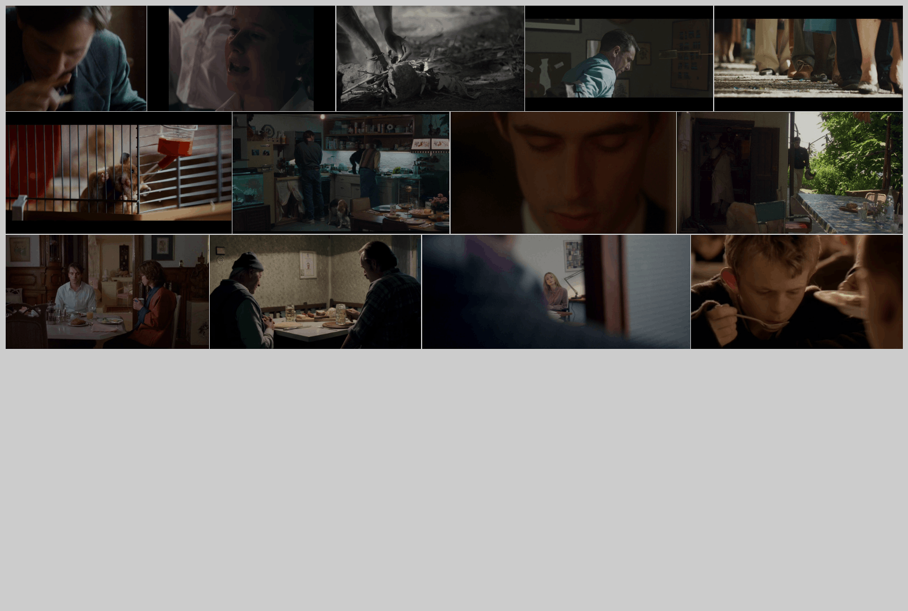

# rosetta

[![CC0 1.0][cc-zero-image]][cc-zero]

[cc-zero]: http://creativecommons.org/licenses/zero/1.0/
[cc-zero-image]: https://i.creativecommons.org/l/zero/1.0/88x31.png
[cc-zero-shield]: https://img.shields.io/badge/License-CC%20ZERO%201.0-lightgrey.svg

From `2023.05`. Applied some editing skills I learned when using the video editor, subtitle editor, dictionaries and translation tools etc.. In my experience, the biggest trouble is that the number of lines in subtitle files in different languages does not match. I don't want to find another tool or tools and restore certain files to their intermediate file form.

## Reference

- [Responsive HTML5 Video Gallery](https://www.lightgalleryjs.com/demos/video-gallery/)  
- [JavaScript gallery with thumbnails.](https://www.lightgalleryjs.com/demos/thumbnails/)  
- [CodePen - lightGallery move next/prev buttons to toolbar](https://codepen.io/sachinchoolur/pen/OJzOgae)

## Tools used

- [Kdenlive](https://kdenlive.org)
- [alass](https://github.com/kaegi/alass)
- [HandBrake](https://handbrake.fr/)
- [SRT to VTT Command Line](https://github.com/nwoltman/srt-to-vtt-cl)
- [lightGallery](https://www.lightgalleryjs.com/)

## Attribute

lightGallery's license is [here](https://www.lightgalleryjs.com/license/).  
The copyright of all film sample belongs to the publisher. I use the low-resolution clip as a reference. Their files are not in this repository.  
Others is under [CC0 1.0](https://creativecommons.org/publicdomain/zero/1.0/).